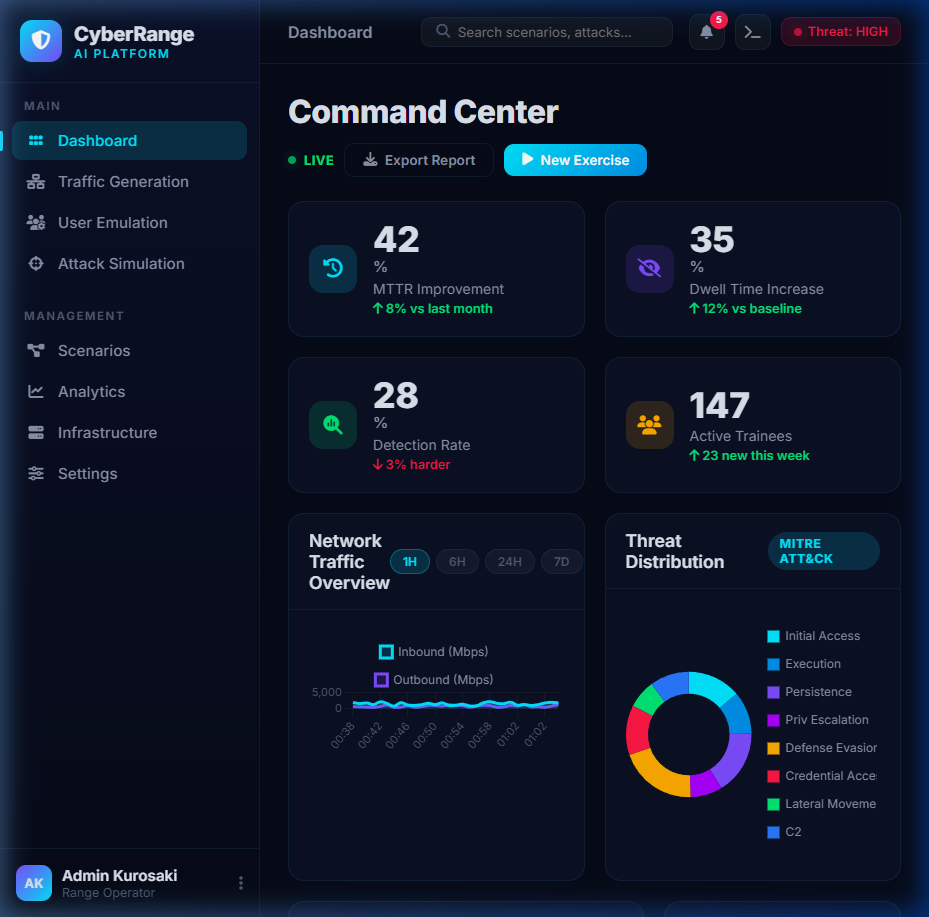
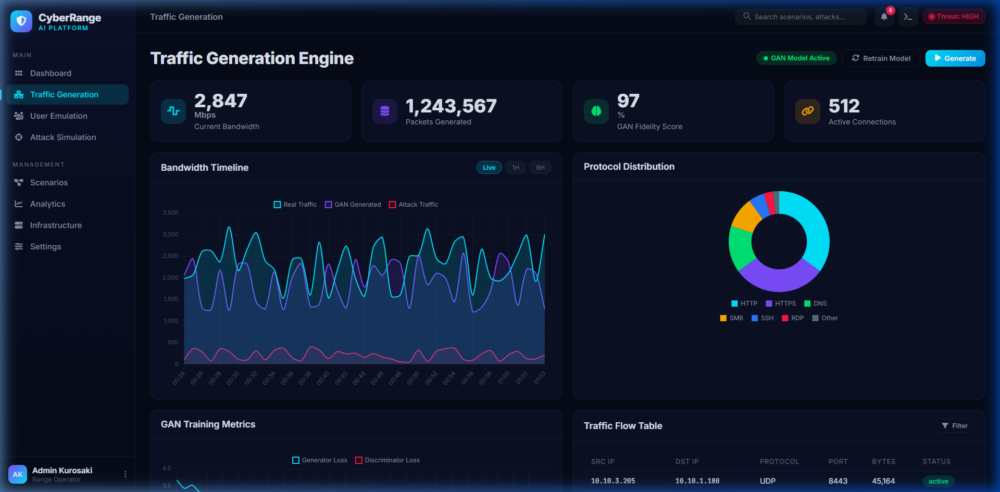
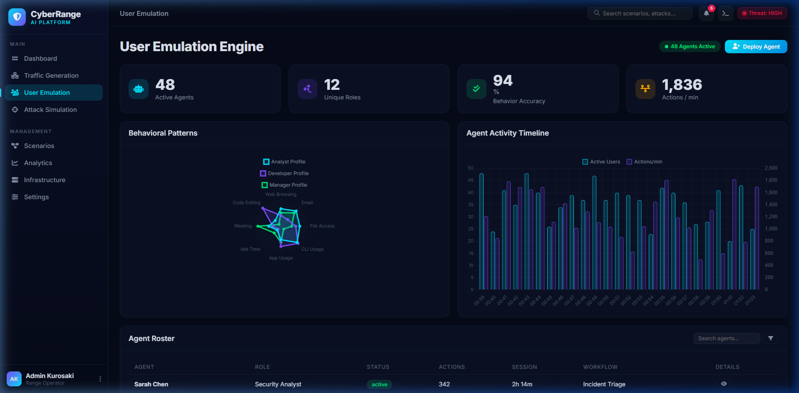
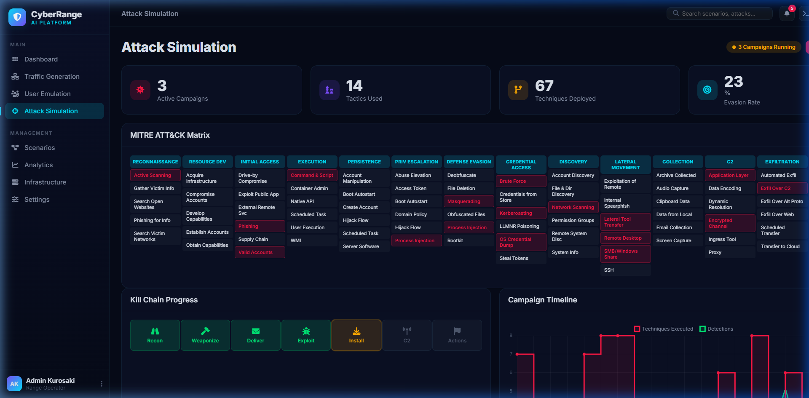
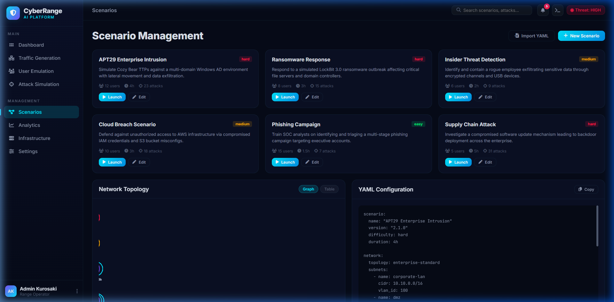
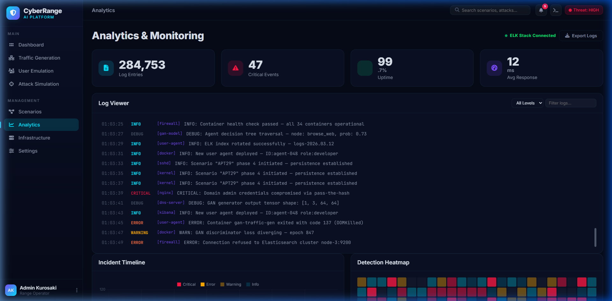
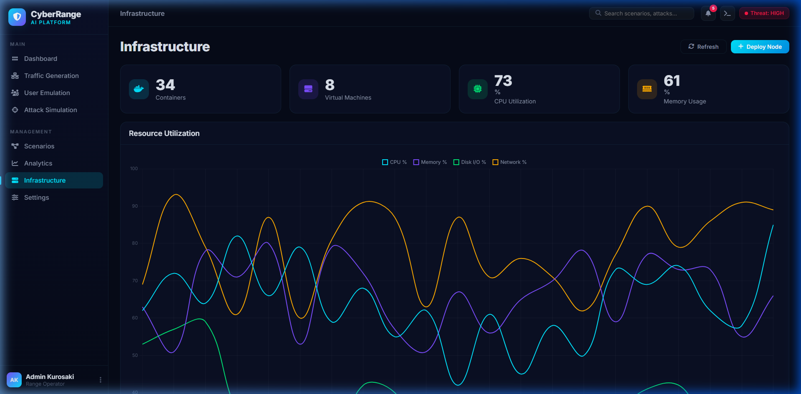
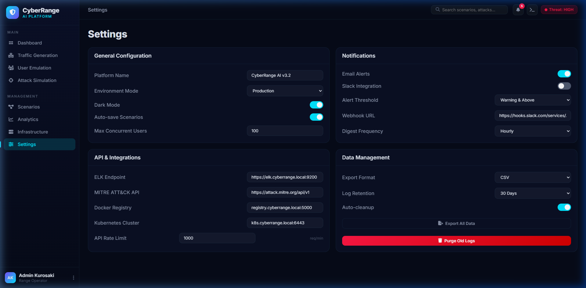

<p align="center">
  
  
  
  
</p>

<h1 align="center">🛡️ CyberRange AI</h1>
<h3 align="center">AI-Driven Cyber Range Platform for Realistic Threat Training & Attack Simulation</h3>

<p align="center">
  <em>A next-generation cybersecurity training platform powered by GAN-based traffic generation, MITRE ATT&CK integration, and real-time attack simulation — built for SOC analysts, red teams, and security researchers.</em>
</p>

---

## 📸 Platform Preview

### 🎯 Command Center Dashboard
Real-time operational overview with live KPIs, network traffic charts, threat distribution analysis, active scenarios, and system health monitoring.



### 🌐 Traffic Generation Engine
GAN-powered synthetic traffic generation with live bandwidth monitoring, protocol distribution analysis, training metrics, and real-time traffic flow tables.



### 👥 User Emulation Engine
AI-driven behavioral emulation with 48+ concurrent agents, 12 unique roles, behavioral pattern radar, and detailed agent roster management.



### ⚔️ Attack Simulation
Full MITRE ATT&CK Matrix integration with active campaign management, kill chain progress tracking, campaign timeline visualization, and live IOC feeds.



### 📋 Scenario Management
Comprehensive scenario builder with difficulty levels, YAML configuration editor, and interactive network topology visualization with animated packet flows.



### 📊 Analytics & Monitoring
ELK Stack-integrated analytics with real-time log viewer, incident timeline, detection heatmap, and performance gauges for complete operational visibility.



### 🖥️ Infrastructure Management
Full infrastructure oversight with Docker container and VM monitoring, CPU/memory utilization charts, and deployment pipeline visualization.



### ⚙️ Settings & Configuration
Platform-wide configuration for general settings, notifications (Email/Slack), API integrations (ELK, MITRE ATT&CK, Docker Registry, Kubernetes), and data management.



---

## 🎬 Platform Walkthrough

> A full interactive walkthrough demonstrating navigation across all modules, live data updates, animated charts, and the platform's real-time capabilities.


---

## ✨ Key Features

### 🔬 Core Capabilities
| Feature | Description |
|---------|-------------|
| **GAN Traffic Generation** | AI-powered synthetic network traffic that mimics real-world patterns with 97% fidelity |
| **MITRE ATT&CK Integration** | Full Enterprise matrix with 14 tactics and 67+ techniques for realistic attack scenarios |
| **User Behavior Emulation** | 48+ concurrent AI agents simulating 12 unique organizational roles (HR, Dev, Admin, etc.) |
| **Real-time Analytics** | ELK Stack-connected monitoring with live log streaming, incident tracking, and heatmaps |
| **Infrastructure Orchestration** | Docker/Kubernetes management with 34 containers and 8 VMs for isolated lab environments |

### 🎮 Interactive Simulations
| Simulation | Description |
|------------|-------------|
| **🖥️ Live Attack Terminal** | Real-time multi-phase attack replay with kill chain progress, MITRE technique mapping, and target info |
| **🧠 GAN Training Visualizer** | Watch the GAN model train in real-time with live loss curves, epoch tracking, and distribution comparison |
| **🎓 Training Exercise Mode** | Timed APT response scenarios with objectives, incoming alerts, and 6 response actions — scored out of 500 |
| **🔍 Packet Inspector** | Wireshark-style deep packet inspection with hex dumps, protocol filtering, and anomaly flagging |
| **🗺️ Live Attack Map** | Animated network topology showing attack propagation, compromised nodes, and defense status in real-time |

### 📈 Dashboard Metrics
- **MTTR Improvement** — 42% faster mean time to respond
- **Dwell Time Increase** — 35% harder for attackers to persist undetected
- **Detection Rate** — 28% challenge rate for red team exercises
- **Active Trainees** — 147 concurrent users across scenarios

---

## 🏗️ Architecture

```
cyber-range/
├── index.html              # Single-page application (870 lines)
├── css/
│   └── styles.css          # Complete design system with dark theme
├── js/
│   ├── data.js             # Mock data, generators, and constants
│   ├── charts.js           # Chart.js configurations (12+ chart types)
│   ├── app.js              # Core application controller & rendering
│   └── simulations.js      # Interactive simulation engines
├── screenshots/            # Platform screenshots & recordings
└── README.md
```

### Tech Stack
| Layer | Technology |
|-------|-----------|
| **Frontend** | Vanilla HTML5, CSS3, JavaScript (ES6+) |
| **Charts** | Chart.js 4.4.1 |
| **Icons** | Font Awesome 6.5.1 |
| **Typography** | Inter + JetBrains Mono (Google Fonts) |
| **Design** | Custom dark theme with glassmorphism, CSS custom properties |

---

## 🚀 Getting Started

### Prerequisites
- Modern web browser (Chrome, Firefox, Edge, Safari)
- No backend, database, or build tools required — **fully client-side**

### Quick Start

```bash
# Clone the repository
git clone https://github.com/abdmath/cyber-range.git

# Navigate into the project
cd cyber-range

# Option 1: Open directly in browser
start index.html          # Windows
open index.html           # macOS
xdg-open index.html       # Linux

# Option 2: Serve with a local server (recommended)
npx http-server . -p 8080
# Then open http://localhost:8080
```

### Live Demo
Simply open `index.html` in any modern browser — all data is generated client-side, no API keys or configuration needed.

---

## 🎨 Design Philosophy

- **Dark Cyber Theme** — Deep navy/slate backgrounds with vibrant cyan, purple, and green accents
- **Glassmorphism** — Frosted glass card effects with subtle backdrop blur
- **Micro-animations** — Smooth page transitions, counter animations, pulse effects, and chart updates
- **Responsive Layout** — Adaptive sidebar with mobile hamburger menu, fluid grid system
- **Live Data Simulation** — Traffic tables refresh every 5s, charts update every 3s, logs stream every 2s

---

## 🗺️ Platform Modules

| Module | Page | Key Components |
|--------|------|----------------|
| **Command Center** | Dashboard | KPI cards, traffic chart, threat donut, scenarios list, alerts feed, health grid |
| **Traffic Engine** | Traffic Generation | Bandwidth timeline, protocol pie, GAN loss curves, traffic table, latency chart |
| **User Emulation** | User Emulation | Behavior radar, agent timeline, agent roster table |
| **Attack Sim** | Attack Simulation | MITRE matrix, kill chain visualization, campaign chart, IOC live feed |
| **Scenarios** | Scenario Management | Scenario cards, network topology canvas, YAML config viewer |
| **Analytics** | Analytics & Monitoring | Log viewer with filters, incident chart, detection heatmap, performance gauges |
| **Infrastructure** | Infrastructure | Resource utilization chart, container/VM lists, deployment pipeline |
| **Settings** | Settings | General config, notifications, API integrations, data management |

---

## 🔐 Security Concepts Covered

- **MITRE ATT&CK Framework** — Full Enterprise Matrix with tactic-to-technique mapping
- **Cyber Kill Chain** — 7-phase attack progression visualization
- **GAN-based Traffic** — Neural networks generating indistinguishable synthetic network traffic
- **IOC Analysis** — IP, domain, hash, and email indicators of compromise
- **PCAP Analysis** — Deep packet inspection with protocol dissection
- **Incident Response** — Timed exercise scenarios for SOC analyst training
- **Network Topology** — Interactive network architecture with animated data flows

---

## 🤝 Contributing

Contributions are welcome! Feel free to submit issues and pull requests.

1. Fork the repository
2. Create your feature branch (`git checkout -b feature/amazing-feature`)
3. Commit your changes (`git commit -m 'Add amazing feature'`)
4. Push to the branch (`git push origin feature/amazing-feature`)
5. Open a Pull Request

---

## 📄 License

This project is licensed under the MIT License — see the [LICENSE](LICENSE) file for details.

---

<p align="center">
  <strong>Built with 🛡️ for the cybersecurity community</strong>
  <br/>
  <sub>CyberRange AI v3.2 — Designed for SOC Analysts, Red Teams, and Security Researchers</sub>
</p>
